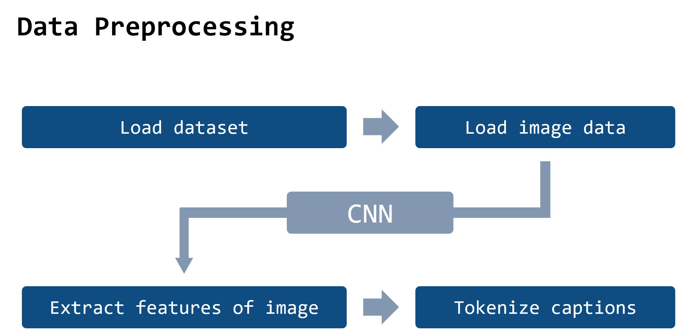
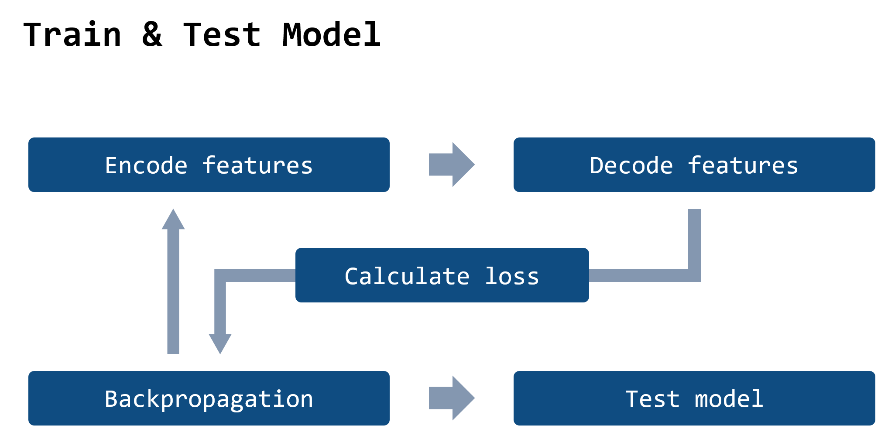
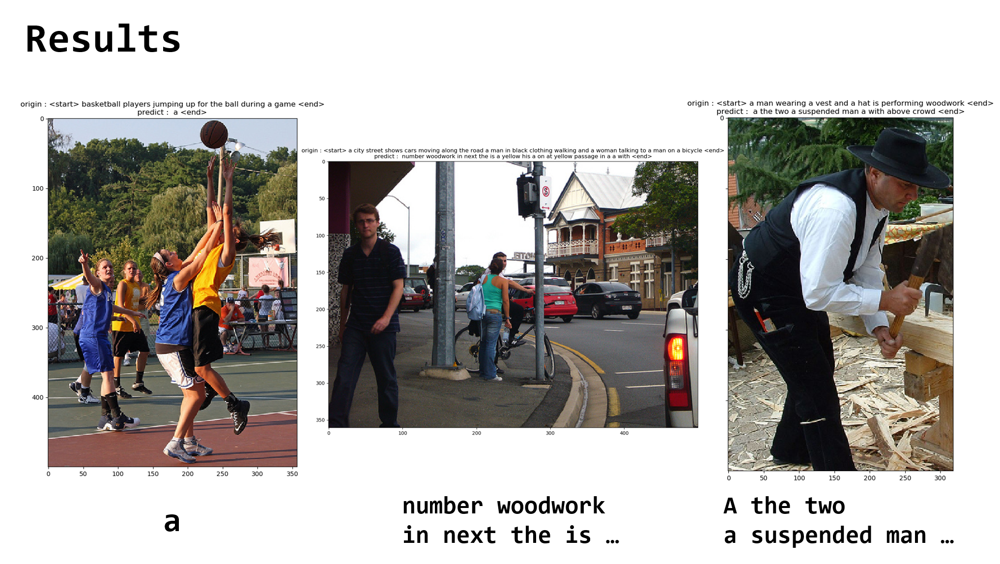
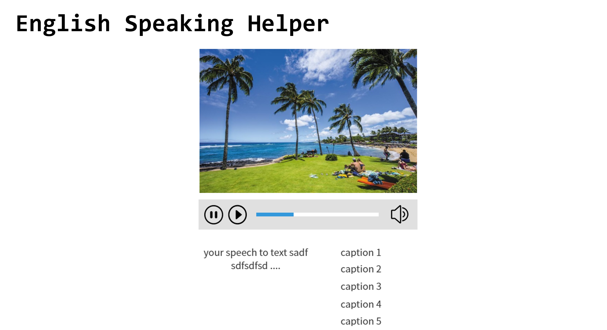

# Sub PJT II. 이미지 캡셔닝 기능 구현


CNN, RNN, 이미지 캡셔닝 모델에 대한 이해

데이터셋 전처리 과정에 대한 이해 및 구현(mini-batch, Loading images, Image Data Augmentation, Tokenize captions, Visualizing datasets)

---

---

<br><br>

## :deciduous_tree: Directory Architecture

```
├── README.md                 - README.md
├── MD_imgs/                  - README.md에 삽입된 이미지가 저장된 폴더
├── Daily/                    - Daily 팀회의 내용과 각 팀원의 Daily commit md가 저장된 폴더
│
|
├── args/                     - 학습 시 사용된 config 정보가 저장되는 폴더
├── checkpoints/              - 학습된 모델이 저장되는 폴더
│   ├── CNN/                 - Feature를 추출하는 CNN 모델을 저장하는 폴더
│   ├── ckpt/                 - 체크포인트가 저장되는 폴더
|
├── data/                     - 데이터 전처리 관련 폴더
│   ├── __init__.py           - 
│   ├── preprocess.py         - 데이터 전처리
|
├── datasets/                 - 전체 데이터셋
│   ├── images/               - 전체 이미지가 들어있는 폴더
│   ├── textTokenizers/       - 토큰화된 캡션이 저장되는 폴더(.txt)
│   ├── captions.csv          - images 폴더의 이미지 파일명 + 캡션 목록
│   ├── linear_test_x.npy     - 스켈레톤 코드 실행을 위한 샘플 데이터(test)
│   ├── linear_train.npy      - 스켈레톤 코드 실행을 위한 샘플 데이터(train)
│   ├── train.txt             - train 데이터목록(이미지 파일명+캡션)
│   ├── val.txt               - test 데이터목록(이미지 파일명+캡션)
|
├── models/                   - 
│   ├── __init__.py           - 
│   ├── decoder.py            - 텍스트 모델링
│   ├── encoder.py            - 이미지 모델링
│   ├── linear_model.py       - 스켈레톤 코드에 사용된 모델이 정의된 클래스
|
├── utils/                    - 유틸리티 관련 폴더
│   ├── __init__.py           - 
│   ├── utils.py              - 환경 설정과 같은 유틸리티 함수들
│   ├── train_utils.py        - 모델 학습시 필요한 유틸리티 함수들
|
├── config.py                 - 모델 학습시 설정하는 파라미터(argparse)
├── FashionMNIST.py           - Fashion MNIST 데이터를 활용한 머신러닝 예제
├── linear_regression.py      - 스켈레톤 예제
├── predict.py                - 
└── train.py                  - 실제 학습이 이루어지는 main
```

---

---

<br>

<br>

## :seedling: Prerequisites


- Anaconda로 python 3.7.6 가상환경 생성
  - `conda create --name envname python=3.7.6`
  - `conda activate envname`으로 가상환경 활성화
  - `conda deactivate`로 현재 활성화되어 있는 가상환경 비활성화
  - `conda remove --name envname`으로 생성한 가상환경 제거
  


- 생성한 가상환경 활성화 후, 필요한 라이브러리 설치
  - 머신러닝
    - Numpy 1.18.1: `conda install -c anaconda numpy=1.18.1`
    - Scipy 1.4.1: `conda  install -c anaconda scipy=1.4.1`
    - Scikit-learn 0.22.1: `conda install -c anaconda scikit-learn=0.22.1`
  - 딥러닝
    - Tensorflow 2.1.0: `conda install -c anaconda tensorflow=2.1.0`
    - Keras 2.2.4-tf: tensorflow 안에 설치되어 있음
    - ~~TensorFlow Addons: `pip install tensorflow-addons`~~
      - ~~TensorFlow의 추가적인 기능들이 제공되는 라이브러리~~ (TensorFlow 2.1.0 이상 버전에서만 사용 가능)
  - 시각화
    - Matplotlib 3.1.3: `conda install -c anaconda matplotlib=3.1.3`
    - Tensorboard 2.1.0: 설치되어 있음
  - 기타
    - Anaconda: `conda install anaconda`
    - tqdm 4.42.1: `conda install -c anaconda tqdm=4.42.1`
      - tqdm: 함수나 반복문의 진행상황을 progress bar로 나타내주는 라이브러리
    - scikit-image: `conda install -c anaconda scikit-image`
      - scikit-image: 이미지 처리를 위한 라이브러리(load, save 등)
    - tensorflow.js: `pip install tensorflowjs`
  


- 스켈레톤 샘플 확인

  - `python linear_regression.py` 실행

  


---

---

<br>

<br>

## :rocket: Our Flow Chart








---

---

<br>

<br>

## :kissing_heart: How to run project

`python train.py` in terminal

---

---

<br>

<br>

## :blossom: interim result




---

---

<br>

<br>

## :runner: About Sub3​



- MockUp : https://ovenapp.io/view/qntuleCwliC7UTpfL7ejg0eYGFi1gcBy/wOANw

- [가제] English Speaking Helper(영어 회화 학습 도우미)
- TOEIC Speaking Part2의 사진을 보고 묘사하는 문제를 보고 영감을 얻음
- 주요 기능
  - 녹음 기능 : 사용자가 마이크에 대고 말을 한 것을 저장
  - 사진 업로드 기능 : 사용자가 업로드한 사진에 대해 캡셔닝
  - Speach to Text 기능 : 사용자가 마이크에 대고 말을 한 것을 얼마나 정확한 발음으로 말하였는지 확인할 수 있게 녹음 내용을  Text화 하는 기능

<br><br>
---

---

## :santa: Final Sub​

## SantaToss
  

- 기획 배경 
  - 어학성적이 꼭 필요한 학생, 취준생들의 비용적 부담감
  - 원하는 파트를 집중학습 할 수 있는 커뮤니티 부재 
  - 이미지의 다양성, 반복 학습의 기회가 적음
  <br>
- 데이터 셋 & AI 모델
  
  <br>

- 기술스택
 
 <br>

- 시스템 구성도
  
  <br>

- 서비스
  1. 이미지 고르기
    
 
  2. 학습 하기
    
 
  3. 결과 확인
    
    <br>
 
- 개발 후기
  - 처음 접하는 인공지능 프로젝트였기 때문에 많은 어려움이 있었지만 데이터 전처리, 인공지능의 학습방법 등을 이해할 수 있었으며, tensorflow, numpy     등의 파이썬 라이브러리를 알게 되었다.
  - 코로나19 여파로 인하여 재택학습을 하게 되어 zoom, Jira, git 등의 협업툴의 필요성을 몸소 느낄 수 있었다.    
